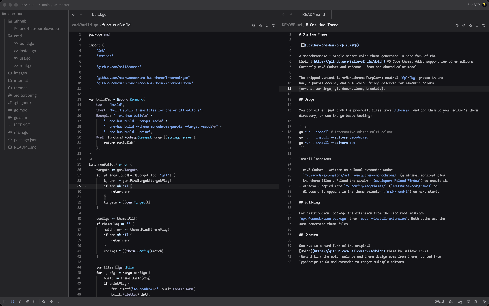

# One Hue Theme



A monochromatic + single accent color theme generator, a hard fork of the
[Dolch](https://github.com/BelleveInvis/dolch) VS Code theme. Added support for other editors.
Currently **VS Code**, **Zed**, **OpenCode** and **Herdr** — from one shared color model.

The shipped variant is **Monochrome-Purple**: neutral `fg`/`bg` grades in one
hue, a purple accent, and a 12-color "ring" reserved for semantic colors
(errors, warnings, git decorations, brackets).

## Usage

You can either just grab the pre-built files from `/themes/` and add them to your editor's theme directory, or use the go-based tooling:

```sh
go run . install # interactive editor multi-select
go run . install --editors vscode,zed,opencode,herdr
go run . install --editors opencode,herdr --theme dolch-blue
```

### Web preview (`serve`)

Spin up a local web app to preview, create and edit theme variants with a live
CodeMirror preview. No npm — HTMX and CodeMirror load from a CDN:

```sh
go run . serve                 # http://localhost:8080
go run . serve --addr :9000    # custom port
```

Pick a theme in the sidebar to preview it, or hit **New theme**. Editing the
name or accent updates the preview immediately; **Save theme** rewrites
`themes.toml` and regenerates every editor target under `themes/`.

Install locations:

- **VS Code** — written as a local extension under
  `~/.vscode/extensions/metruzanca.theme-monochrome/` (a minimal manifest plus
  the theme files). Reload the window (`Developer: Reload Window`) to enable it.
- **Zed** — copied into `~/.config/zed/themes/` (`%APPDATA%\Zed\themes` on
  Windows). It appears in the theme selector (`cmd-k cmd-t`) on next start.
- **OpenCode** — copied into `~/.config/opencode/themes/`
  (`$XDG_CONFIG_HOME/opencode/themes`, `%APPDATA%\opencode\themes` on Windows).
  Select with `/theme` on next start.
- **Herdr** — merges the chosen variant's `[theme.custom]` block into
  `~/.config/herdr/config.toml` (`HERDR_CONFIG_PATH` is honored,
  `%APPDATA%\herdr\config.toml` on Windows). Herdr holds one active theme, so
  pass `--theme <slug>` when several variants exist, or pick from the prompt.
  Run `herdr server reload-config` to apply.

## Building

For distribution, package the extension from the repo root instead:
`npx @vscode/vsce package` then `code --install-extension`. Both paths use the
same generated theme files.

## Credits

One Hue is a hard fork of the original
[Dolch](https://github.com/BelleveInvis/dolch) theme by Belleve Invis
(Renzhi Li): the color science and theme design come from there, ported from
TypeScript to Go and extended to target multiple editors.
